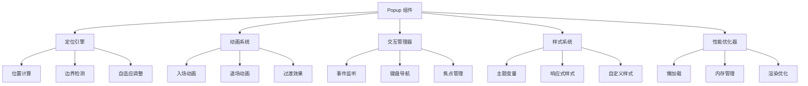

# 通用 Popup 组件设计文档

## 1. 项目背景与需求分析

### 1.1 当前状态
- **LinkPreviewer 组件**：已完整实现，包含防抖、缓存、错误处理等功能
- **现有 Popup 组件**：简单的容器组件，使用 Portal 渲染，功能有限
- **技术栈**：Astro + SolidJS + TypeScript + UnoCSS
- **主题风格**：深色主题，使用紫色/橙色作为强调色

### 1.2 需求分析
基于 LinkPreviewer 的使用场景和项目整体需求，Popup 组件需要支持：

1. **位置定位**：智能边界检测、多种定位模式
2. **动画效果**：淡入淡出、缩放、滑动等过渡效果
3. **交互功能**：多种关闭方式、键盘支持、点击外部关闭
4. **样式系统**：主题适配、响应式、可定制样式
5. **性能优化**：懒加载、动画优化、内存管理
6. **通用性**：支持多种使用场景，易于复用

## 2. 组件架构设计

### 2.1 整体架构



### 2.2 组件接口设计

```typescript
// 基础属性接口
interface PopupBaseProps {
  // 显示控制
  show: boolean;
  onClose?: () => void;

  // 内容
  children: JSXElement;

  // 基础样式
  class?: string;
  style?: JSX.CSSProperties | string;

  // 基础配置
  id?: string;
  zIndex?: number;
}

// 定位相关接口
interface PopupPositionProps {
  // 目标元素
  target?: HTMLElement | { x: number; y: number };

  // 定位模式
  placement?: 'top' | 'bottom' | 'left' | 'right' | 'center' | 'auto';

  // 偏移量
  offset?: [number, number]; // [x, y]

  // 边界检测
  boundary?: 'viewport' | 'window' | 'parent' | HTMLElement;

  // 自适应
  autoAdjust?: boolean;
  flip?: boolean;
  shift?: boolean;
}

// 动画相关接口
interface PopupAnimationProps {
  // 动画类型
  animation?: 'fade' | 'scale' | 'slide' | 'bounce' | 'none' | 'custom';

  // 动画方向
  direction?: 'up' | 'down' | 'left' | 'right';

  // 动画时长
  duration?: number;

  // 动画延迟
  delay?: number;

  // 自定义动画类
  animationClass?: {
    enter?: string;
    enterActive?: string;
    exit?: string;
    exitActive?: string;
  };
}

// 交互相关接口
interface PopupInteractionProps {
  // 关闭方式
  closeOnOutsideClick?: boolean;
  closeOnEscape?: boolean;
  closeOnScroll?: boolean;

  // 悬停行为
  hoverDelay?: number;
  leaveDelay?: number;

  // 焦点管理
  trapFocus?: boolean;
  initialFocus?: HTMLElement | 'first' | 'last' | 'container';

  // 阻止滚动
  preventScroll?: boolean;

  // 懒加载
  lazy?: boolean;
  lazyThreshold?: number;
}

// 主题相关接口
interface PopupThemeProps {
  // 主题变体
  variant?: 'default' | 'tooltip' | 'modal' | 'dropdown' | 'custom';

  // 尺寸
  size?: 'sm' | 'md' | 'lg' | 'xl' | 'full';

  // 圆角
  rounded?: 'none' | 'sm' | 'md' | 'lg' | 'xl' | 'full';

  // 阴影
  shadow?: 'none' | 'sm' | 'md' | 'lg' | 'xl' | '2xl';

  // 边框
  border?: boolean | string;

  // 背景模糊
  backdrop?: boolean | 'sm' | 'md' | 'lg' | 'xl';

  // 自定义主题
  theme?: {
    background?: string;
    foreground?: string;
    border?: string;
    shadow?: string;
  };
}

// 完整的 Popup Props 接口
interface PopupProps extends
  PopupBaseProps,
  PopupPositionProps,
  PopupAnimationProps,
  PopupInteractionProps,
  PopupThemeProps {

  // 高级配置
  portal?: boolean | string;
  strategy?: 'absolute' | 'fixed';

  // 事件回调
  onShow?: () => void;
  onShown?: () => void;
  onHide?: () => void;
  onHidden?: () => void;
  onPositionUpdate?: (position: Position) => void;

  // 渲染控制
  render?: (props: PopupRenderProps) => JSXElement;

  // 测试
  testId?: string;
}

// 内部使用的位置接口
interface Position {
  x: number;
  y: number;
  width?: number;
  height?: number;
  placement?: string;
  adjusted?: boolean;
}

// 渲染属性接口
interface PopupRenderProps {
  position: Position;
  isShowing: boolean;
  isHiding: boolean;
  close: () => void;
  updatePosition: () => void;
}
```

## 3. 位置定位策略设计

### 3.1 定位算法

```typescript
// 位置计算核心算法
class PositionEngine {
  private popup: HTMLElement;
  private target: HTMLElement | { x: number; y: number };
  private options: PopupPositionProps;

  calculatePosition(): Position {
    const targetRect = this.getTargetRect();
    const popupRect = this.getPopupRect();
    const viewport = this.getViewport();

    // 根据 placement 计算初始位置
    let position = this.calculateInitialPosition(targetRect, popupRect);

    // 边界检测和调整
    if (this.options.autoAdjust) {
      position = this.adjustForBoundaries(position, viewport, popupRect);
    }

    // 翻转处理
    if (this.options.flip) {
      position = this.handleFlip(position, targetRect, popupRect, viewport);
    }

    // 偏移处理
    position = this.applyOffset(position);

    return position;
  }

  private calculateInitialPosition(targetRect: DOMRect, popupRect: DOMRect): Position {
    const { placement } = this.options;
    const offset = this.options.offset || [0, 0];

    switch (placement) {
      case 'top':
        return {
          x: targetRect.left + targetRect.width / 2 - popupRect.width / 2 + offset[0],
          y: targetRect.top - popupRect.height + offset[1],
          placement: 'top'
        };

      case 'bottom':
        return {
          x: targetRect.left + targetRect.width / 2 - popupRect.width / 2 + offset[0],
          y: targetRect.bottom + offset[1],
          placement: 'bottom'
        };

      case 'left':
        return {
          x: targetRect.left - popupRect.width + offset[0],
          y: targetRect.top + targetRect.height / 2 - popupRect.height / 2 + offset[1],
          placement: 'left'
        };

      case 'right':
        return {
          x: targetRect.right + offset[0],
          y: targetRect.top + targetRect.height / 2 - popupRect.height / 2 + offset[1],
          placement: 'right'
        };

      case 'center':
        return {
          x: window.innerWidth / 2 - popupRect.width / 2 + offset[0],
          y: window.innerHeight / 2 - popupRect.height / 2 + offset[1],
          placement: 'center'
        };

      case 'auto':
      default:
        return this.calculateAutoPosition(targetRect, popupRect);
    }
  }

  private calculateAutoPosition(targetRect: DOMRect, popupRect: DOMRect): Position {
    const viewport = this.getViewport();
    const space = {
      top: targetRect.top,
      bottom: viewport.height - targetRect.bottom,
      left: targetRect.left,
      right: viewport.width - targetRect.right
    };

    // 选择空间最大的方向
    const maxSpace = Math.max(space.top, space.bottom, space.left, space.right);

    if (maxSpace === space.bottom) {
      return this.calculateInitialPosition(targetRect, popupRect);
    } else if (maxSpace === space.top) {
      return this.calculateInitialPosition(targetRect, popupRect);
    } else if (maxSpace === space.right) {
      return this.calculateInitialPosition(targetRect, popupRect);
    } else {
      return this.calculateInitialPosition(targetRect, popupRect);
    }
  }

  private adjustForBoundaries(position: Position, viewport: Viewport, popupRect: DOMRect): Position {
    let adjusted = false;

    // 水平边界检测
    if (position.x < 0) {
      position.x = 10;
      adjusted = true;
    } else if (position.x + popupRect.width > viewport.width) {
      position.x = viewport.width - popupRect.width - 10;
      adjusted = true;
    }

    // 垂直边界检测
    if (position.y < 0) {
      position.y = 10;
      adjusted = true;
    } else if (position.y + popupRect.height > viewport.height) {
      position.y = viewport.height - popupRect.height - 10;
      adjusted = true;
    }

    position.adjusted = adjusted;
    return position;
  }

  private handleFlip(position: Position, targetRect: DOMRect, popupRect: DOMRect, viewport: Viewport): Position {
    const { placement } = position;

    // 水平翻转
    if (placement === 'left' && position.x < 0) {
      position.x = targetRect.right;
      position.placement = 'right';
      position.adjusted = true;
    } else if (placement === 'right' && position.x + popupRect.width > viewport.width) {
      position.x = targetRect.left - popupRect.width;
      position.placement = 'left';
      position.adjusted = true;
    }

    // 垂直翻转
    if (placement === 'top' && position.y < 0) {
      position.y = targetRect.bottom;
      position.placement = 'bottom';
      position.adjusted = true;
    } else if (placement === 'bottom' && position.y + popupRect.height > viewport.height) {
      position.y = targetRect.top - popupRect.height;
      position.placement = 'top';
      position.adjusted = true;
    }

    return position;
  }
}
```

### 3.2 边界检测策略

1. **视口边界检测**：确保 Popup 不会超出视口范围
2. **容器边界检测**：在指定容器内显示
3. **智能翻转**：当空间不足时自动翻转位置
4. **自适应偏移**：根据边界情况调整偏移量

## 4. 动画效果设计

### 4.1 动画类型

```typescript
// 动画配置
const ANIMATION_PRESETS = {
  fade: {
    enter: 'opacity-0',
    enterActive: 'opacity-100 transition-opacity duration-200',
    exit: 'opacity-100',
    exitActive: 'opacity-0 transition-opacity duration-150'
  },

  scale: {
    enter: 'opacity-0 scale-95',
    enterActive: 'opacity-100 scale-100 transition-all duration-200 ease-out',
    exit: 'opacity-100 scale-100',
    exitActive: 'opacity-0 scale-95 transition-all duration-150 ease-in'
  },

  slide: {
    up: {
      enter: 'opacity-0 transform translate-y-2',
      enterActive: 'opacity-100 transform translate-y-0 transition-all duration-200 ease-out',
      exit: 'opacity-100 transform translate-y-0',
      exitActive: 'opacity-0 transform translate-y-2 transition-all duration-150 ease-in'
    },
    down: {
      enter: 'opacity-0 transform -translate-y-2',
      enterActive: 'opacity-100 transform translate-y-0 transition-all duration-200 ease-out',
      exit: 'opacity-100 transform translate-y-0',
      exitActive: 'opacity-0 transform -translate-y-2 transition-all duration-150 ease-in'
    },
    left: {
      enter: 'opacity-0 transform translate-x-2',
      enterActive: 'opacity-100 transform translate-x-0 transition-all duration-200 ease-out',
      exit: 'opacity-100 transform translate-x-0',
      exitActive: 'opacity-0 transform translate-x-2 transition-all duration-150 ease-in'
    },
    right: {
      enter: 'opacity-0 transform -translate-x-2',
      enterActive: 'opacity-100 transform translate-x-0 transition-all duration-200 ease-out',
      exit: 'opacity-100 transform translate-x-0',
      exitActive: 'opacity-0 transform -translate-x-2 transition-all duration-150 ease-in'
    }
  },

  bounce: {
    enter: 'opacity-0 scale-0',
    enterActive: 'opacity-100 scale-100 transition-all duration-300 ease-bounce',
    exit: 'opacity-100 scale-100',
    exitActive: 'opacity-0 scale-0 transition-all duration-200 ease-in'
  }
};
```

### 4.2 动画系统实现

```typescript
class AnimationManager {
  private element: HTMLElement;
  private options: PopupAnimationProps;
  private animationState: 'entering' | 'entered' | 'exiting' | 'exited' = 'exited';

  async show(): Promise<void> {
    if (this.animationState === 'entering' || this.animationState === 'entered') {
      return;
    }

    this.animationState = 'entering';
    this.applyEnterClasses();

    // 触发重排以确保动画生效
    this.element.offsetHeight;

    this.applyEnterActiveClasses();

    // 等待动画完成
    await this.waitForAnimation();
    this.animationState = 'entered';
  }

  async hide(): Promise<void> {
    if (this.animationState === 'exiting' || this.animationState === 'exited') {
      return;
    }

    this.animationState = 'exiting';
    this.applyExitClasses();

    // 触发重排
    this.element.offsetHeight;

    this.applyExitActiveClasses();

    // 等待动画完成
    await this.waitForAnimation();
    this.animationState = 'exited';
  }

  private applyEnterClasses(): void {
    const preset = this.getAnimationPreset();
    this.element.classList.add(...preset.enter.split(' '));
  }

  private applyEnterActiveClasses(): void {
    const preset = this.getAnimationPreset();
    this.element.classList.add(...preset.enterActive.split(' '));
  }

  private applyExitClasses(): void {
    const preset = this.getAnimationPreset();
    this.element.classList.remove(...preset.enterActive.split(' '));
    this.element.classList.add(...preset.exit.split(' '));
  }

  private applyExitActiveClasses(): void {
    const preset = this.getAnimationPreset();
    this.element.classList.add(...preset.exitActive.split(' '));
  }

  private getAnimationPreset() {
    const { animation, direction } = this.options;

    if (this.options.animationClass) {
      return this.options.animationClass;
    }

    if (animation === 'slide' && direction) {
      return ANIMATION_PRESETS.slide[direction];
    }

    return ANIMATION_PRESETS[animation || 'fade'];
  }

  private waitForAnimation(): Promise<void> {
    return new Promise(resolve => {
      const handleAnimationEnd = () => {
        this.element.removeEventListener('animationend', handleAnimationEnd);
        this.element.removeEventListener('transitionend', handleAnimationEnd);
        resolve();
      };

      this.element.addEventListener('animationend', handleAnimationEnd);
      this.element.addEventListener('transitionend', handleAnimationEnd);

      // 备用超时
      setTimeout(resolve, this.options.duration || 300);
    });
  }
}
```

## 5. 样式系统设计

### 5.1 主题变量

```typescript
// 主题配置
const POPUP_THEME = {
  // 基础颜色
  colors: {
    background: 'rgb(17, 24, 39)', // gray-900
    foreground: 'rgb(156, 163, 175)', // gray-400
    border: 'rgb(139, 92, 246, 0.2)', // violet-500/20
    shadow: 'rgba(0, 0, 0, 0.5)',

    // 强调色
    accent: {
      primary: 'rgb(139, 92, 246)', // violet-500
      secondary: 'rgb(251, 146, 60)', // orange-400
    }
  },

  // 尺寸配置
  sizes: {
    sm: 'w-48 h-32',
    md: 'w-64 h-48',
    lg: 'w-80 h-60',
    xl: 'w-96 h-72',
    full: 'w-screen h-screen'
  },

  // 圆角配置
  rounded: {
    none: 'rounded-none',
    sm: 'rounded-sm',
    md: 'rounded-md',
    lg: 'rounded-lg',
    xl: 'rounded-xl',
    full: 'rounded-full'
  },

  // 阴影配置
  shadows: {
    none: '',
    sm: 'shadow-sm',
    md: 'shadow-md',
    lg: 'shadow-lg',
    xl: 'shadow-xl',
    '2xl': 'shadow-2xl'
  },

  // 背景模糊配置
  backdrop: {
    sm: 'backdrop-blur-sm',
    md: 'backdrop-blur-md',
    lg: 'backdrop-blur-lg',
    xl: 'backdrop-blur-xl'
  }
};
```

### 5.2 变体样式

```typescript
// 预定义变体
const POPUP_VARIANTS = {
  default: {
    base: 'bg-gray-900/95 backdrop-blur-sm border border-violet-500/20 shadow-2xl rounded-lg',
    content: 'text-gray-400'
  },

  tooltip: {
    base: 'bg-gray-800/95 backdrop-blur-sm border border-gray-700/50 shadow-lg rounded-md py-2 px-3',
    content: 'text-gray-300 text-sm'
  },

  modal: {
    base: 'bg-gray-900/95 backdrop-blur-md border border-violet-500/30 shadow-2xl rounded-xl',
    content: 'text-gray-300'
  },

  dropdown: {
    base: 'bg-gray-800/95 backdrop-blur-sm border border-gray-700/50 shadow-xl rounded-lg py-2',
    content: 'text-gray-300'
  }
};
```

## 6. 交互功能设计

### 6.1 事件管理

```typescript
class InteractionManager {
  private popup: HTMLElement;
  private options: PopupInteractionProps;
  private eventListeners: Map<string, EventListener> = new Map();

  setup(): void {
    this.setupOutsideClick();
    this.setupEscapeKey();
    this.setupScrollEvents();
    this.setupFocusTrap();
    this.setupHoverEvents();
  }

  cleanup(): void {
    this.eventListeners.forEach((listener, event) => {
      document.removeEventListener(event, listener);
    });
    this.eventListeners.clear();
  }

  private setupOutsideClick(): void {
    if (!this.options.closeOnOutsideClick) return;

    const handleClick = (event: MouseEvent) => {
      if (!this.popup.contains(event.target as Node)) {
        this.options.onClose?.();
      }
    };

    document.addEventListener('click', handleClick);
    this.eventListeners.set('click', handleClick);
  }

  private setupEscapeKey(): void {
    if (!this.options.closeOnEscape) return;

    const handleKeyDown = (event: KeyboardEvent) => {
      if (event.key === 'Escape') {
        event.preventDefault();
        this.options.onClose?.();
      }
    };

    document.addEventListener('keydown', handleKeyDown);
    this.eventListeners.set('keydown', handleKeyDown);
  }

  private setupScrollEvents(): void {
    if (!this.options.closeOnScroll) return;

    const handleScroll = () => {
      this.options.onClose?.();
    };

    window.addEventListener('scroll', handleScroll);
    this.eventListeners.set('scroll', handleScroll);
  }

  private setupFocusTrap(): void {
    if (!this.options.trapFocus) return;

    const focusableElements = this.popup.querySelectorAll(
      'button, [href], input, select, textarea, [tabindex]:not([tabindex="-1"])'
    ) as NodeListOf<HTMLElement>;

    const firstElement = focusableElements[0];
    const lastElement = focusableElements[focusableElements.length - 1];

    const handleTabKey = (event: KeyboardEvent) => {
      if (event.key !== 'Tab') return;

      if (event.shiftKey) {
        if (document.activeElement === firstElement) {
          lastElement.focus();
          event.preventDefault();
        }
      } else {
        if (document.activeElement === lastElement) {
          firstElement.focus();
          event.preventDefault();
        }
      }
    };

    this.popup.addEventListener('keydown', handleTabKey);

    // 设置初始焦点
    this.setInitialFocus();
  }

  private setInitialFocus(): void {
    const { initialFocus } = this.options;

    if (!initialFocus) return;

    if (initialFocus === 'first') {
      const firstFocusable = this.popup.querySelector(
        'button, [href], input, select, textarea, [tabindex]:not([tabindex="-1"])'
      ) as HTMLElement;
      firstFocusable?.focus();
    } else if (initialFocus === 'last') {
      const focusableElements = this.popup.querySelectorAll(
        'button, [href], input, select, textarea, [tabindex]:not([tabindex="-1"])'
      ) as NodeListOf<HTMLElement>;
      const lastFocusable = focusableElements[focusableElements.length - 1];
      lastFocusable?.focus();
    } else if (initialFocus === 'container') {
      this.popup.setAttribute('tabindex', '-1');
      this.popup.focus();
    }
  }
}
```

## 7. 性能优化策略

### 7.1 懒加载实现

```typescript
class LazyLoader {
  private options: PopupInteractionProps;
  private observer: IntersectionObserver | null = null;
  private hasLoaded = false;

  constructor(element: HTMLElement, options: PopupInteractionProps) {
    this.options = options;
    this.setupObserver(element);
  }

  private setupObserver(element: HTMLElement): void {
    if (!this.options.lazy) return;

    this.observer = new IntersectionObserver(
      (entries) => {
        entries.forEach(entry => {
          if (entry.isIntersecting && !this.hasLoaded) {
            this.hasLoaded = true;
            this.loadContent();
            this.observer?.disconnect();
          }
        });
      },
      {
        threshold: this.options.lazyThreshold || 0.1
      }
    );

    this.observer.observe(element);
  }

  private loadContent(): void {
    // 触发内容加载
    this.options.onShow?.();
  }

  destroy(): void {
    this.observer?.disconnect();
  }
}
```

### 7.2 内存管理

```typescript
class MemoryManager {
  private cleanupTasks: (() => void)[] = [];

  addCleanupTask(task: () => void): void {
    this.cleanupTasks.push(task);
  }

  cleanup(): void {
    this.cleanupTasks.forEach(task => task());
    this.cleanupTasks = [];
  }
}
```

## 8. 与 LinkPreviewer 的集成方案

### 8.1 适配器模式

```typescript
// LinkPreviewer 专用配置
const LINKPREVIEWER_CONFIG: Partial<PopupProps> = {
  placement: 'bottom',
  offset: [0, 16],
  animation: 'scale',
  duration: 200,
  closeOnOutsideClick: true,
  closeOnEscape: true,
  closeOnScroll: true,
  variant: 'default',
  size: 'md',
  rounded: 'lg',
  shadow: '2xl',
  backdrop: true,
  autoAdjust: true,
  flip: true,
  shift: true
};

// LinkPreviewer 适配器
export function createLinkPreviewerPopup(url: string, targetRect: DOMRect) {
  return (
    <Popup
      show={true}
      target={{ x: targetRect.left + targetRect.width / 2, y: targetRect.bottom }}
      {...LINKPREVIEWER_CONFIG}
    >
      {/* LinkPreviewer 内容 */}
    </Popup>
  );
}
```

### 8.2 性能优化

1. **内容缓存**：复用已加载的 iframe 内容
2. **防抖处理**：避免频繁创建/销毁 Popup
3. **懒加载**：只在需要时加载内容
4. **内存管理**：及时清理事件监听器和定时器

## 9. 使用示例

### 9.1 基础用法

```typescript
// 简单的 Tooltip
<Popup
  show={showTooltip}
  target={buttonRef}
  placement="top"
  animation="fade"
  variant="tooltip"
>
  这是一个提示信息
</Popup>

// 模态框
<Popup
  show={showModal}
  placement="center"
  animation="scale"
  variant="modal"
  size="lg"
  closeOnOutsideClick={true}
  closeOnEscape={true}
  trapFocus={true}
>
  <div class="p-6">
    <h2 class="text-xl font-bold mb-4">模态框标题</h2>
    <p class="mb-4">模态框内容</p>
    <button onClick={closeModal}>关闭</button>
  </div>
</Popup>

// 下拉菜单
<Popup
  show={showDropdown}
  target={menuButtonRef}
  placement="bottom"
  animation="slide"
  direction="down"
  variant="dropdown"
  closeOnOutsideClick={true}
>
  <ul class="py-2">
    <li><a href="#" class="block px-4 py-2 hover:bg-gray-700">选项 1</a></li>
    <li><a href="#" class="block px-4 py-2 hover:bg-gray-700">选项 2</a></li>
    <li><a href="#" class="block px-4 py-2 hover:bg-gray-700">选项 3</a></li>
  </ul>
</Popup>
```

### 9.2 高级用法

```typescript
// 自定义动画
<Popup
  show={showCustom}
  target={targetRef}
  animation="custom"
  animationClass={{
    enter: 'opacity-0 transform rotate-12 scale-50',
    enterActive: 'opacity-100 transform rotate-0 scale-100 transition-all duration-500 ease-out',
    exit: 'opacity-100 transform rotate-0 scale-100',
    exitActive: 'opacity-0 transform -rotate-12 scale-50 transition-all duration-300 ease-in'
  }}
>
  自定义动画内容
</Popup>

// 响应式位置
<Popup
  show={showResponsive}
  target={targetRef}
  placement="auto"
  autoAdjust={true}
  flip={true}
  shift={true}
  onPositionUpdate={(position) => {
    console.log('位置更新:', position);
  }}
>
  响应式位置内容
</Popup>

// 懒加载内容
<Popup
  show={showLazy}
  target={targetRef}
  lazy={true}
  lazyThreshold={0.2}
  onShow={() => {
    // 加载内容
    loadContent();
  }}
>
  懒加载内容
</Popup>
```

## 10. 实现要点总结

### 10.1 核心特性

1. **智能定位**：支持多种定位模式，自动边界检测和翻转
2. **丰富动画**：预设多种动画效果，支持自定义动画
3. **灵活交互**：多种关闭方式，键盘导航，焦点管理
4. **主题系统**：深色主题适配，多种预设变体
5. **性能优化**：懒加载，内存管理，渲染优化

### 10.2 技术亮点

1. **模块化设计**：定位引擎、动画系统、交互管理器独立模块
2. **类型安全**：完整的 TypeScript 类型定义
3. **响应式设计**：支持各种屏幕尺寸和设备
4. **可扩展性**：插件化架构，易于扩展新功能
5. **兼容性**：与现代浏览器完全兼容

### 10.3 最佳实践

1. **性能优先**：避免不必要的重渲染和内存泄漏
2. **用户体验**：流畅的动画和直观的交互
3. **可访问性**：支持键盘导航和屏幕阅读器
4. **可维护性**：清晰的代码结构和文档
5. **测试友好**：提供测试工具和测试用例

这个设计文档提供了一个完整的 Popup 组件架构，可以满足 LinkPreviewer 的所有需求，同时作为一个通用组件可以在项目的其他地方复用。组件设计遵循了现代前端开发的最佳实践，具有良好的可扩展性和可维护性。
