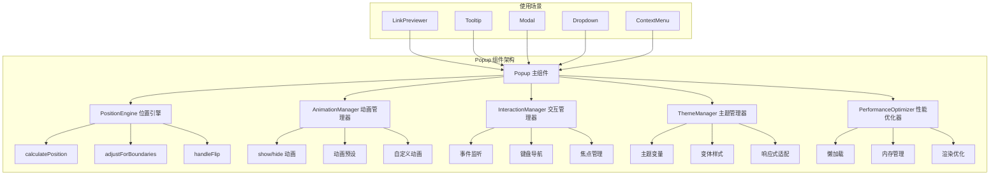

# Popup 组件实现示例

## 1. 组件结构图



## 2. 核心组件实现

### 2.1 Popup 主组件

```typescript
// src/components/Popup.tsx
import {
  createSignal,
  createEffect,
  onMount,
  onCleanup,
  Show,
  type JSXElement,
  type JSX
} from 'solid-js';
import { Portal } from 'solid-js/web';
import classNames from 'classnames';
import { PositionEngine } from './utils/PositionEngine';
import { AnimationManager } from './utils/AnimationManager';
import { InteractionManager } from './utils/InteractionManager';
import { ThemeManager } from './utils/ThemeManager';
import { PerformanceOptimizer } from './utils/PerformanceOptimizer';
import type { PopupProps, Position } from './types';

export default function Popup(props: PopupProps) {
  const [isShowing, setIsShowing] = createSignal(false);
  const [isHiding, setIsHiding] = createSignal(false);
  const [position, setPosition] = createSignal<Position>({ x: 0, y: 0 });
  const [popupElement, setPopupElement] = createSignal<HTMLElement>();

  // 管理器实例
  let positionEngine: PositionEngine;
  let animationManager: AnimationManager;
  let interactionManager: InteractionManager;
  let themeManager: ThemeManager;
  let performanceOptimizer: PerformanceOptimizer;

  // 初始化管理器
  onMount(() => {
    const element = popupElement();
    if (!element) return;

    positionEngine = new PositionEngine(element, props);
    animationManager = new AnimationManager(element, props);
    interactionManager = new InteractionManager(element, props);
    themeManager = new ThemeManager(element, props);
    performanceOptimizer = new PerformanceOptimizer(element, props);

    // 设置性能优化
    performanceOptimizer.setup();
  });

  // 监听显示状态变化
  createEffect(() => {
    if (props.show && !isShowing()) {
      showPopup();
    } else if (!props.show && isShowing()) {
      hidePopup();
    }
  });

  // 显示 Popup
  async function showPopup() {
    setIsShowing(true);
    setIsHiding(false);

    // 计算位置
    const newPosition = positionEngine.calculatePosition();
    setPosition(newPosition);
    props.onPositionUpdate?.(newPosition);

    // 应用主题
    themeManager.applyTheme();

    // 设置交互
    interactionManager.setup();

    // 执行动画
    await animationManager.show();

    props.onShown?.();
  }

  // 隐藏 Popup
  async function hidePopup() {
    setIsHiding(true);

    // 执行退场动画
    await animationManager.hide();

    // 清理交互
    interactionManager.cleanup();

    setIsShowing(false);
    setIsHiding(false);

    props.onHidden?.();
  }

  // 更新位置
  function updatePosition() {
    if (!props.show) return;
    const newPosition = positionEngine.calculatePosition();
    setPosition(newPosition);
    props.onPositionUpdate?.(newPosition);
  }

  // 关闭 Popup
  function closePopup() {
    props.onClose?.();
  }

  // 计算样式
  const computedStyle = () => {
    const baseStyle: JSX.CSSProperties = {
      position: props.strategy || 'fixed',
      left: `${position().x}px`,
      top: `${position().y}px`,
      'z-index': props.zIndex || 50
    };

    if (typeof props.style === 'string') {
      return props.style;
    }

    return { ...baseStyle, ...(props.style as JSX.CSSProperties || {}) };
  };

  // 计算类名
  const computedClass = () => {
    return classNames(
      'popup-component',
      props.class,
      themeManager.getBaseClasses(),
      themeManager.getVariantClasses()
    );
  };

  // 渲染内容
  const renderContent = () => {
    if (props.render) {
      return props.render({
        position: position(),
        isShowing: isShowing(),
        isHiding: isHiding(),
        close: closePopup,
        updatePosition
      });
    }

    return props.children;
  };

  return (
    <Show when={props.show}>
      <Portal mount={props.portal === true ? document.body : props.portal || undefined}>
        <div
          ref={setPopupElement}
          class={computedClass()}
          style={computedStyle()}
          data-testid={props.testId}
          data-placement={position().placement}
          data-adjusted={position().adjusted}
        >
          {renderContent()}
        </div>
      </Portal>
    </Show>
  );
}
```

### 2.2 类型定义

```typescript
// src/components/types.ts
import type { JSXElement, JSX } from 'solid-js';

export interface PopupBaseProps {
  show: boolean;
  onClose?: () => void;
  children: JSXElement;
  class?: string;
  style?: JSX.CSSProperties | string;
  id?: string;
  zIndex?: number;
}

export interface PopupPositionProps {
  target?: HTMLElement | { x: number; y: number };
  placement?: 'top' | 'bottom' | 'left' | 'right' | 'center' | 'auto';
  offset?: [number, number];
  boundary?: 'viewport' | 'window' | 'parent' | HTMLElement;
  autoAdjust?: boolean;
  flip?: boolean;
  shift?: boolean;
}

export interface PopupAnimationProps {
  animation?: 'fade' | 'scale' | 'slide' | 'bounce' | 'none' | 'custom';
  direction?: 'up' | 'down' | 'left' | 'right';
  duration?: number;
  delay?: number;
  animationClass?: {
    enter?: string;
    enterActive?: string;
    exit?: string;
    exitActive?: string;
  };
}

export interface PopupInteractionProps {
  closeOnOutsideClick?: boolean;
  closeOnEscape?: boolean;
  closeOnScroll?: boolean;
  hoverDelay?: number;
  leaveDelay?: number;
  trapFocus?: boolean;
  initialFocus?: HTMLElement | 'first' | 'last' | 'container';
  preventScroll?: boolean;
  lazy?: boolean;
  lazyThreshold?: number;
}

export interface PopupThemeProps {
  variant?: 'default' | 'tooltip' | 'modal' | 'dropdown' | 'custom';
  size?: 'sm' | 'md' | 'lg' | 'xl' | 'full';
  rounded?: 'none' | 'sm' | 'md' | 'lg' | 'xl' | 'full';
  shadow?: 'none' | 'sm' | 'md' | 'lg' | 'xl' | '2xl';
  border?: boolean | string;
  backdrop?: boolean | 'sm' | 'md' | 'lg' | 'xl';
  theme?: {
    background?: string;
    foreground?: string;
    border?: string;
    shadow?: string;
  };
}

export interface PopupProps extends
  PopupBaseProps,
  PopupPositionProps,
  PopupAnimationProps,
  PopupInteractionProps,
  PopupThemeProps {

  portal?: boolean | string;
  strategy?: 'absolute' | 'fixed';

  onShow?: () => void;
  onShown?: () => void;
  onHide?: () => void;
  onHidden?: () => void;
  onPositionUpdate?: (position: Position) => void;

  render?: (props: PopupRenderProps) => JSXElement;
  testId?: string;
}

export interface Position {
  x: number;
  y: number;
  width?: number;
  height?: number;
  placement?: string;
  adjusted?: boolean;
}

export interface PopupRenderProps {
  position: Position;
  isShowing: boolean;
  isHiding: boolean;
  close: () => void;
  updatePosition: () => void;
}

export interface Viewport {
  width: number;
  height: number;
  scrollX: number;
  scrollY: number;
}
```

### 2.3 位置引擎实现

```typescript
// src/components/utils/PositionEngine.ts
import type { PopupProps, Position, Viewport } from '../types';

export class PositionEngine {
  private popup: HTMLElement;
  private options: PopupPositionProps;

  constructor(popup: HTMLElement, options: PopupProps) {
    this.popup = popup;
    this.options = options;
  }

  calculatePosition(): Position {
    const targetRect = this.getTargetRect();
    const popupRect = this.getPopupRect();
    const viewport = this.getViewport();

    // 计算初始位置
    let position = this.calculateInitialPosition(targetRect, popupRect);

    // 边界检测和调整
    if (this.options.autoAdjust) {
      position = this.adjustForBoundaries(position, viewport, popupRect);
    }

    // 翻转处理
    if (this.options.flip) {
      position = this.handleFlip(position, targetRect, popupRect, viewport);
    }

    // 偏移处理
    position = this.applyOffset(position);

    return position;
  }

  private getTargetRect(): DOMRect {
    if (!this.options.target) {
      // 如果没有目标，使用视口中心
      return {
        left: window.innerWidth / 2,
        top: window.innerHeight / 2,
        right: window.innerWidth / 2,
        bottom: window.innerHeight / 2,
        width: 0,
        height: 0,
        x: window.innerWidth / 2,
        y: window.innerHeight / 2,
        toJSON: () => ({})
      } as DOMRect;
    }

    if (typeof this.options.target === 'object' && 'x' in this.options.target) {
      // 坐标对象
      const { x, y } = this.options.target;
      return {
        left: x,
        top: y,
        right: x,
        bottom: y,
        width: 0,
        height: 0,
        x,
        y,
        toJSON: () => ({})
      } as DOMRect;
    }

    // HTMLElement
    return this.options.target.getBoundingClientRect();
  }

  private getPopupRect(): DOMRect {
    return this.popup.getBoundingClientRect();
  }

  private getViewport(): Viewport {
    return {
      width: window.innerWidth,
      height: window.innerHeight,
      scrollX: window.scrollX,
      scrollY: window.scrollY
    };
  }

  private calculateInitialPosition(targetRect: DOMRect, popupRect: DOMRect): Position {
    const { placement } = this.options;
    const offset = this.options.offset || [0, 0];

    switch (placement) {
      case 'top':
        return {
          x: targetRect.left + targetRect.width / 2 - popupRect.width / 2 + offset[0],
          y: targetRect.top - popupRect.height + offset[1],
          placement: 'top'
        };

      case 'bottom':
        return {
          x: targetRect.left + targetRect.width / 2 - popupRect.width / 2 + offset[0],
          y: targetRect.bottom + offset[1],
          placement: 'bottom'
        };

      case 'left':
        return {
          x: targetRect.left - popupRect.width + offset[0],
          y: targetRect.top + targetRect.height / 2 - popupRect.height / 2 + offset[1],
          placement: 'left'
        };

      case 'right':
        return {
          x: targetRect.right + offset[0],
          y: targetRect.top + targetRect.height / 2 - popupRect.height / 2 + offset[1],
          placement: 'right'
        };

      case 'center':
        return {
          x: window.innerWidth / 2 - popupRect.width / 2 + offset[0],
          y: window.innerHeight / 2 - popupRect.height / 2 + offset[1],
          placement: 'center'
        };

      case 'auto':
      default:
        return this.calculateAutoPosition(targetRect, popupRect);
    }
  }

  private calculateAutoPosition(targetRect: DOMRect, popupRect: DOMRect): Position {
    const viewport = this.getViewport();
    const space = {
      top: targetRect.top,
      bottom: viewport.height - targetRect.bottom,
      left: targetRect.left,
      right: viewport.width - targetRect.right
    };

    // 选择空间最大的方向
    const maxSpace = Math.max(space.top, space.bottom, space.left, space.right);

    if (maxSpace === space.bottom) {
      return this.calculateInitialPosition(targetRect, popupRect);
    } else if (maxSpace === space.top) {
      return this.calculateInitialPosition(targetRect, popupRect);
    } else if (maxSpace === space.right) {
      return this.calculateInitialPosition(targetRect, popupRect);
    } else {
      return this.calculateInitialPosition(targetRect, popupRect);
    }
  }

  private adjustForBoundaries(position: Position, viewport: Viewport, popupRect: DOMRect): Position {
    let adjusted = false;

    // 水平边界检测
    if (position.x < 0) {
      position.x = 10;
      adjusted = true;
    } else if (position.x + popupRect.width > viewport.width) {
      position.x = viewport.width - popupRect.width - 10;
      adjusted = true;
    }

    // 垂直边界检测
    if (position.y < 0) {
      position.y = 10;
      adjusted = true;
    } else if (position.y + popupRect.height > viewport.height) {
      position.y = viewport.height - popupRect.height - 10;
      adjusted = true;
    }

    position.adjusted = adjusted;
    return position;
  }

  private handleFlip(position: Position, targetRect: DOMRect, popupRect: DOMRect, viewport: Viewport): Position {
    const { placement } = position;

    // 水平翻转
    if (placement === 'left' && position.x < 0) {
      position.x = targetRect.right;
      position.placement = 'right';
      position.adjusted = true;
    } else if (placement === 'right' && position.x + popupRect.width > viewport.width) {
      position.x = targetRect.left - popupRect.width;
      position.placement = 'left';
      position.adjusted = true;
    }

    // 垂直翻转
    if (placement === 'top' && position.y < 0) {
      position.y = targetRect.bottom;
      position.placement = 'bottom';
      position.adjusted = true;
    } else if (placement === 'bottom' && position.y + popupRect.height > viewport.height) {
      position.y = targetRect.top - popupRect.height;
      position.placement = 'top';
      position.adjusted = true;
    }

    return position;
  }

  private applyOffset(position: Position): Position {
    const offset = this.options.offset || [0, 0];
    position.x += offset[0];
    position.y += offset[1];
    return position;
  }
}
```

### 2.4 动画管理器实现

```typescript
// src/components/utils/AnimationManager.ts
import type { PopupAnimationProps } from '../types';

export class AnimationManager {
  private element: HTMLElement;
  private options: PopupAnimationProps;
  private animationState: 'entering' | 'entered' | 'exiting' | 'exited' = 'exited';

  constructor(element: HTMLElement, options: PopupAnimationProps) {
    this.element = element;
    this.options = options;
  }

  async show(): Promise<void> {
    if (this.animationState === 'entering' || this.animationState === 'entered') {
      return;
    }

    this.animationState = 'entering';
    this.applyEnterClasses();

    // 触发重排以确保动画生效
    this.element.offsetHeight;

    this.applyEnterActiveClasses();

    // 等待动画完成
    await this.waitForAnimation();
    this.animationState = 'entered';
  }

  async hide(): Promise<void> {
    if (this.animationState === 'exiting' || this.animationState === 'exited') {
      return;
    }

    this.animationState = 'exiting';
    this.applyExitClasses();

    // 触发重排
    this.element.offsetHeight;

    this.applyExitActiveClasses();

    // 等待动画完成
    await this.waitForAnimation();
    this.animationState = 'exited';
  }

  private applyEnterClasses(): void {
    const preset = this.getAnimationPreset();
    if (preset.enter) {
      this.element.classList.add(...preset.enter.split(' '));
    }
  }

  private applyEnterActiveClasses(): void {
    const preset = this.getAnimationPreset();
    if (preset.enterActive) {
      this.element.classList.add(...preset.enterActive.split(' '));
    }
  }

  private applyExitClasses(): void {
    const preset = this.getAnimationPreset();
    if (preset.enterActive) {
      this.element.classList.remove(...preset.enterActive.split(' '));
    }
    if (preset.exit) {
      this.element.classList.add(...preset.exit.split(' '));
    }
  }

  private applyExitActiveClasses(): void {
    const preset = this.getAnimationPreset();
    if (preset.exitActive) {
      this.element.classList.add(...preset.exitActive.split(' '));
    }
  }

  private getAnimationPreset() {
    const { animation, direction } = this.options;

    if (this.options.animationClass) {
      return this.options.animationClass;
    }

    if (animation === 'none') {
      return {
        enter: '',
        enterActive: '',
        exit: '',
        exitActive: ''
      };
    }

    // 返回预设动画
    return this.getPresetAnimation(animation, direction);
  }

  private getPresetAnimation(animation?: string, direction?: string) {
    const duration = this.options.duration || 200;

    switch (animation) {
      case 'fade':
        return {
          enter: 'opacity-0',
          enterActive: `opacity-100 transition-opacity duration-${duration}`,
          exit: 'opacity-100',
          exitActive: `opacity-0 transition-opacity duration-${Math.floor(duration * 0.75)}`
        };

      case 'scale':
        return {
          enter: 'opacity-0 scale-95',
          enterActive: `opacity-100 scale-100 transition-all duration-${duration} ease-out`,
          exit: 'opacity-100 scale-100',
          exitActive: `opacity-0 scale-95 transition-all duration-${Math.floor(duration * 0.75)} ease-in`
        };

      case 'slide':
        return this.getSlideAnimation(direction, duration);

      case 'bounce':
        return {
          enter: 'opacity-0 scale-0',
          enterActive: `opacity-100 scale-100 transition-all duration-${duration} ease-bounce`,
          exit: 'opacity-100 scale-100',
          exitActive: `opacity-0 scale-0 transition-all duration-${Math.floor(duration * 0.75)} ease-in`
        };

      default:
        return this.getPresetAnimation('fade');
    }
  }

  private getSlideAnimation(direction?: string, duration?: number) {
    const dir = direction || 'up';
    const dur = duration || 200;

    const slideClasses = {
      up: {
        enter: 'opacity-0 transform translate-y-2',
        enterActive: `opacity-100 transform translate-y-0 transition-all duration-${dur} ease-out`,
        exit: 'opacity-100 transform translate-y-0',
        exitActive: `opacity-0 transform translate-y-2 transition-all duration-${Math.floor(dur * 0.75)} ease-in`
      },
      down: {
        enter: 'opacity-0 transform -translate-y-2',
        enterActive: `opacity-100 transform translate-y-0 transition-all duration-${dur} ease-out`,
        exit: 'opacity-100 transform translate-y-0',
        exitActive: `opacity-0 transform -translate-y-2 transition-all duration-${Math.floor(dur * 0.75)} ease-in`
      },
      left: {
        enter: 'opacity-0 transform translate-x-2',
        enterActive: `opacity-100 transform translate-x-0 transition-all duration-${dur} ease-out`,
        exit: 'opacity-100 transform translate-x-0',
        exitActive: `opacity-0 transform translate-x-2 transition-all duration-${Math.floor(dur * 0.75)} ease-in`
      },
      right: {
        enter: 'opacity-0 transform -translate-x-2',
        enterActive: `opacity-100 transform translate-x-0 transition-all duration-${dur} ease-out`,
        exit: 'opacity-100 transform translate-x-0',
        exitActive: `opacity-0 transform -translate-x-2 transition-all duration-${Math.floor(dur * 0.75)} ease-in`
      }
    };

    return slideClasses[dir] || slideClasses.up;
  }

  private waitForAnimation(): Promise<void> {
    return new Promise(resolve => {
      const handleAnimationEnd = () => {
        this.element.removeEventListener('animationend', handleAnimationEnd);
        this.element.removeEventListener('transitionend', handleAnimationEnd);
        resolve();
      };

      this.element.addEventListener('animationend', handleAnimationEnd);
      this.element.addEventListener('transitionend', handleAnimationEnd);

      // 备用超时
      setTimeout(resolve, this.options.duration || 300);
    });
  }
}
```

## 3. LinkPreviewer 集成示例

### 3.1 更新后的 LinkPreviewer 组件

```typescript
// src/components/LinkPreviewer.tsx
import classNames from 'classnames';
import {
  onCleanup,
  onMount,
  createSignal,
  createEffect,
  Show,
  For,
  type JSXElement,
} from 'solid-js';
import Popup from './Popup';
import type { PopupProps } from './types';

interface LinkPreviewerProps {
  children?: JSXElement;
  url: string;
}

// LinkPreviewer 专用的 Popup 配置
const LINKPREVIEWER_POPUP_CONFIG: Partial<PopupProps> = {
  placement: 'bottom',
  offset: [0, 16],
  animation: 'scale',
  duration: 200,
  closeOnOutsideClick: true,
  closeOnEscape: true,
  closeOnScroll: true,
  variant: 'default',
  size: 'md',
  rounded: 'lg',
  shadow: '2xl',
  backdrop: true,
  autoAdjust: true,
  flip: true,
  shift: true,
  zIndex: 50
};

export default function LinkPreviewer(props: LinkPreviewerProps) {
  const [showPreviewer, setShowPreviewer] = createSignal(false);
  const [targetElement, setTargetElement] = createSignal<HTMLElement>();
  const [isLoading, setIsLoading] = createSignal(false);
  const [hasError, setHasError] = createSignal(false);
  const [errorMessage, setErrorMessage] = createSignal('');
  const [iframeSrc, setIframeSrc] = createSignal('');

  let debounceTimer: number | undefined;
  let loadTimer: number | undefined;

  // 防抖处理
  function debounceShowPreview() {
    clearTimeout(debounceTimer);
    debounceTimer = window.setTimeout(() => {
      showPreview();
    }, 300);
  }

  // 显示预览
  function showPreview() {
    // 验证URL
    if (!isValidUrl(props.url)) {
      setHasError(true);
      setErrorMessage('无效的URL地址');
      setShowPreviewer(true);
      return;
    }

    // 移动端禁用预览
    if (isMobileDevice()) {
      return;
    }

    setShowPreviewer(true);
    loadPreview();
  }

  // 加载预览
  function loadPreview() {
    setIsLoading(true);
    setHasError(false);
    setErrorMessage('');
    setIframeSrc('');

    setTimeout(() => {
      setIframeSrc(props.url);

      loadTimer = window.setTimeout(() => {
        setIsLoading(false);
        setHasError(true);
        setErrorMessage('加载超时，请稍后重试');
      }, 10000);
    }, 100);
  }

  // 验证URL
  function isValidUrl(url: string) {
    try {
      new URL(url);
      return true;
    } catch {
      return false;
    }
  }

  // 检查是否为移动设备
  function isMobileDevice() {
    return window.innerWidth <= 768;
  }

  // iframe加载成功
  function handleIframeLoad() {
    clearTimeout(loadTimer);
    setIsLoading(false);
    setHasError(false);
  }

  // iframe加载失败
  function handleIframeError() {
    clearTimeout(loadTimer);
    setIsLoading(false);
    setHasError(true);
    setErrorMessage('无法加载预览内容，可能是跨域限制或网络问题');
  }

  // 鼠标进入
  function handleMouseEnter(e: MouseEvent) {
    const target = e.target as HTMLElement;
    setTargetElement(target);
    debounceShowPreview();
  }

  // 鼠标离开
  function handleMouseLeave() {
    clearTimeout(debounceTimer);
    clearTimeout(loadTimer);
    setShowPreviewer(false);
    setIsLoading(false);
    setHasError(false);
    setErrorMessage('');
    setIframeSrc('');
  }

  // 链接点击
  function handleLinkClick(event: MouseEvent) {
    event.preventDefault();
    window.open(props.url, '_blank');
  }

  onCleanup(() => {
    clearTimeout(debounceTimer);
    clearTimeout(loadTimer);
  });

  return (
    <>
      <a
        href={props.url}
        data-hover
        class="text-violet-500 hover:text-violet-400 transition-colors duration-200"
        onMouseEnter={handleMouseEnter}
        onMouseLeave={handleMouseLeave}
        onClick={handleLinkClick}
      >
        {props.children}
      </a>

      <Popup
        show={showPreviewer()}
        target={targetElement()}
        onClose={() => {
          setShowPreviewer(false);
          setIsLoading(false);
          setHasError(false);
          setErrorMessage('');
          setIframeSrc('');
        }}
        {...LINKPREVIEWER_POPUP_CONFIG}
        style={{
          width: '384px',
          height: '256px',
        }}
      >
        <div class="relative w-full h-full">
          {/* 加载状态 */}
          <Show when={isLoading()}>
            <div class="absolute inset-0 flex items-center justify-center bg-gray-900/90">
              <div class="flex flex-col items-center space-y-3">
                <div class="w-8 h-8 border-2 border-violet-500 border-t-transparent rounded-full animate-spin"></div>
                <span class="text-gray-400 text-sm">正在加载预览...</span>
              </div>
            </div>
          </Show>

          {/* 错误状态 */}
          <Show when={hasError()}>
            <div class="absolute inset-0 flex items-center justify-center bg-gray-900/90">
              <div class="flex flex-col items-center space-y-3 p-4 text-center">
                <div class="w-12 h-12 rounded-full bg-red-500/20 flex items-center justify-center">
                  <svg class="w-6 h-6 text-red-500" fill="none" stroke="currentColor" viewBox="0 0 24 24">
                    <path stroke-linecap="round" stroke-linejoin="round" stroke-width="2" d="M12 8v4m0 4h.01M21 12a9 9 0 11-18 0 9 9 0 0118 0z"></path>
                  </svg>
                </div>
                <span class="text-gray-400 text-sm">{errorMessage()}</span>
                <button
                  class="px-3 py-1 bg-violet-500 text-white text-sm rounded hover:bg-violet-600 transition-colors"
                  onClick={() => window.open(props.url, '_blank')}
                >
                  访问链接
                </button>
              </div>
            </div>
          </Show>

          {/* iframe预览 */}
          <Show when={!isLoading() && !hasError() && iframeSrc()}>
            <iframe
              src={iframeSrc()}
              class="w-full h-full border-0"
              style={{
                transform: 'scale(0.28)',
                'transform-origin': 'top left',
                width: '1200px',
                height: '800px',
              }}
              onLoad={handleIframeLoad}
              onError={handleIframeError}
              loading="lazy"
              sandbox="allow-same-origin allow-scripts allow-popups"
            />
          </Show>

          {/* 标题栏 */}
          <div class="absolute top-0 left-0 right-0 h-8 bg-gradient-to-b from-gray-900/80 to-transparent pointer-events-none">
            <div class="flex items-center justify-between h-full px-3">
              <span class="text-gray-400 text-xs truncate max-w-[200px]">
                {new URL(props.url).hostname}
              </span>
              <div class="flex space-x-1">
                <div class="w-2 h-2 rounded-full bg-red-500"></div>
                <div class="w-2 h-2 rounded-full bg-yellow-500"></div>
                <div class="w-2 h-2 rounded-full bg-green-500"></div>
              </div>
            </div>
          </div>
        </div>
      </Popup>
    </>
  );
}
```

## 4. 使用示例

### 4.1 Tooltip 示例

```typescript
// 示例：Tooltip 组件
function Tooltip(props: { text: string; children: JSXElement }) {
  const [show, setShow] = createSignal(false);
  const [target, setTarget] = createSignal<HTMLElement>();

  return (
    <>
      <div
        ref={setTarget}
        onMouseEnter={() => setShow(true)}
        onMouseLeave={() => setShow(false)}
      >
        {props.children}
      </div>

      <Popup
        show={show()}
        target={target()}
        placement="top"
        animation="fade"
        variant="tooltip"
        closeOnOutsideClick={false}
        closeOnEscape={false}
      >
        {props.text}
      </Popup>
    </>
  );
}

// 使用
<Tooltip text="这是一个提示信息">
  <button>悬停显示提示</button>
</Tooltip>
```

### 4.2 Modal 示例

```typescript
// 示例：Modal 组件
function Modal(props: {
  show: boolean;
  onClose: () => void;
  title: string;
  children: JSXElement
}) {
  return (
    <Popup
      show={props.show}
      placement="center"
      animation="scale"
      variant="modal"
      size="lg"
      closeOnOutsideClick={true}
      closeOnEscape={true}
      trapFocus={true}
      onClose={props.onClose}
    >
      <div class="p-6">
        <div class="flex items-center justify-between mb-4">
          <h2 class="text-xl font-bold text-gray-200">{props.title}</h2>
          <button
            onClick={props.onClose}
            class="text-gray-400 hover:text-gray-200"
          >
            <svg class="w-6 h-6" fill="none" stroke="currentColor" viewBox="0 0 24 24">
              <path stroke-linecap="round" stroke-linejoin="round" stroke-width="2" d="M6 18L18 6M6 6l12 12"></path>
            </svg>
          </button>
        </div>
        {props.children}
      </div>
    </Popup>
  );
}

// 使用
function App() {
  const [showModal, setShowModal] = createSignal(false);

  return (
    <div>
      <button onClick={() => setShowModal(true)}>打开模态框</button>

      <Modal
        show={showModal()}
        onClose={() => setShowModal(false)}
        title="模态框标题"
      >
        <p class="text-gray-300 mb-4">这是模态框的内容</p>
        <button
          onClick={() => setShowModal(false)}
          class="px-4 py-2 bg-violet-500 text-white rounded hover:bg-violet-600"
        >
          关闭
        </button>
      </Modal>
    </div>
  );
}
```

### 4.3 Dropdown 示例

```typescript
// 示例：Dropdown 组件
function Dropdown(props: {
  trigger: JSXElement;
  items: Array<{ label: string; onClick: () => void }>
}) {
  const [show, setShow] = createSignal(false);
  const [target, setTarget] = createSignal<HTMLElement>();

  return (
    <>
      <div ref={setTarget} onClick={() => setShow(!show())}>
        {props.trigger}
      </div>

      <Popup
        show={show()}
        target={target()}
        placement="bottom"
        animation="slide"
        direction="down"
        variant="dropdown"
        closeOnOutsideClick={true}
        onClose={() => setShow(false)}
      >
        <ul class="py-2">
          <For each={props.items}>
            {item => (
              <li>
                <button
                  onClick={() => {
                    item.onClick();
                    setShow(false);
                  }}
                  class="block w-full text-left px-4 py-2 text-gray-300 hover:bg-gray-700 hover:text-white"
                >
                  {item.label}
                </button>
              </li>
            )}
          </For>
        </ul>
      </Popup>
    </>
  );
}

// 使用
function App() {
  return (
    <Dropdown
      trigger={
        <button class="px-4 py-2 bg-violet-500 text-white rounded hover:bg-violet-600">
          下拉菜单
        </button>
      }
      items={[
        { label: '选项 1', onClick: () => console.log('选项 1') },
        { label: '选项 2', onClick: () => console.log('选项 2') },
        { label: '选项 3', onClick: () => console.log('选项 3') }
      ]}
    />
  );
}
```

## 5. 总结

这个 Popup 组件实现具有以下特点：

1. **高度可配置**：支持多种定位、动画、主题和交互选项
2. **性能优化**：懒加载、内存管理、渲染优化
3. **类型安全**：完整的 TypeScript 类型定义
4. **易于使用**：简洁的 API 和丰富的预设配置
5. **可扩展性**：模块化设计，易于扩展新功能
6. **兼容性**：与 LinkPreviewer 完美集成，支持各种使用场景

通过这个设计，Popup 组件可以满足项目中各种弹出层需求，同时保持代码的可维护性和可扩展性。
